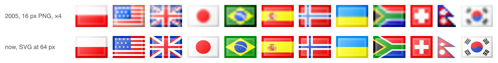

# famfamfam-flags-svg



An unofficial rebuild of [Mark James' famfamfam flag icons](https://web.archive.org/web/20201209062923/http://www.famfamfam.com/lab/icons/flags/)
as SVG. Same 16×11 footprint, same glossy bevelled frame, same punchy
palette, but resolution-independent: crisp at 1×, sharp at 2× and 4×.

274 flags in 279 files: every icon of the 2005 set under its original file
name (plus the five legacy aliases), 30 flags that did not exist or were
missing then, and current designs wherever a flag has changed since.

## Use

Straight from a CDN, nothing to install:

```html
<link rel="stylesheet" href="https://cdn.jsdelivr.net/npm/famfamfam-flags-svg@0.1.4/dist/famfamfam-flags.css">
<span class="famfamfam-flag famfamfam-flag-pl" role="img" aria-label="Poland"></span>


```

Or host the files yourself, which is better for production sites since it
avoids a third-party request. Get them as a zip of `dist/` from the
[latest release](https://github.com/jakuborlowski/famfamfam-flags-svg/releases/latest/download/famfamfam-flags-svg.zip)
(SVGs, PNGs at 1×, 2× and 4×, the CSS, a manifest, the license) or with
`npm install famfamfam-flags-svg` (SVGs, CSS and manifest), then:

```html

      <!-- any size -->

<link rel="stylesheet" href="famfamfam-flags.css">   <!-- keep svg/ next to it -->
```

[Every flag at four sizes](https://jakuborlowski.github.io/famfamfam-flags-svg/preview.html).

Files are named by lowercase ISO 3166-1 alpha-2 code where one exists and
by flag-icons' code otherwise (`gb-sct`, `eu`, `un`). `dist/manifest.json`
has one entry per file, so you can generate alt text or check that every
country in your data has a flag:

| Field | Meaning |
| --- | --- |
| `code`, `name` | file name without `.svg`, and the name used in the file's `<title>` |
| `width`, `height` | icon size: 16×11, except Switzerland 11×11 and Nepal 9×11 |
| `aliases` | other files with the same flag (the original set's legacy names) |
| `aliasOf` | on an alias file: the code it is a copy of |
| `legacy` | the flag was in the 2005 set (true for `eu`, whose 2005 file was `europeanunion`) |
| `iconNative` | drawn on the pixel grid rather than scaled from official artwork |
| `note` | why a flag was drawn or chosen the way it was, when that needs saying |

## Guarantees

* **Stable names.** Files will not be renamed; aliases are real files, not
  redirects; retired codes stay.
* **Safe to inline.** Every file has a `<title>`, ids prefixed with its code
  so any number can share one document, and no scripts, styles, text,
  images, filters or external references. `npm test` checks all of it.
* **Small.** Most flags are about 3 KB. Emblem flags are held to 8 KB by
  reducing geometry under measured render-error bounds, overall and in every
  small area so no emblem is lost; the 20 that still exceed it are listed in
  `src/oversize.json`, the largest at 48 KB.
* **Crisp at 1×.** The frame and bevel sit on whole pixels, band edges and
  thin stripes land on whole pixels as in the originals, and flags whose
  official artwork cannot survive 16 px (the US stripes, the Nordic crosses,
  the Union Jack) are drawn on the pixel grid the way the originals were.
* **No gaps or seams.** Every pixel of every icon is opaque at 1×, 2× and
  4×, on light and dark pages: the artwork is painted three times so
  neighbouring shapes never let the page show through between them. (Pages
  that inline hundreds of flags get three references to each artwork.)

## How the look was reproduced

The originals are flag drawings with one shared layer effect on top: every
icon carries the same overlay, pixel for pixel. That overlay was read off all
the originals at once and fitted by least squares to 0.6/255 RMS. In
`tools/style.js`, all along a 47.5° diagonal:

| Layer | What it does |
| --- | --- |
| Gloss | white, 40% at the top-left fading to 2% at the bottom-right |
| Bevel | the 1 px ring inside the frame gets a constant extra 16% white |
| Shade | up to 6% black towards the bottom-right |
| Frame | the flag's own edge colours, colour-burned and darkened along the diagonal |

Colours were the other half, and they turned out to have a source. Mark
picked most of them from the [Flags of the World](https://www.fotw.info/flags/fotwcols.html)
reference images of 2005, which were drawn in a 32-colour web-safe palette:
every red `#FF0000`, every green `#009900`, every yellow `#FFFF00` unless the
contributor coded it "dark yellow", `#FFCC00`. Archived copies of those images
match his colours flag by flag. His blues he mostly brightened by hand, so
navies read as blue at 16 px. `tools/color.js` snaps saturated reds,
oranges, yellows, greens and blues onto that palette and maps everything else
smoothly; the catalog records the per-flag choices that came from the 2005
images, such as dark yellow, the darkest navies and the exact blues. `FAM_COLORS=official` keeps
official colours. The scripts and notes behind all of this are in `research/`.

The frame is the one layer that depends on the artwork. Mark's frame darkens
mid tones far harder than bright ones, a colour burn, which keeps his frames
deep red, forest green and navy rather than grey. Blend modes would need a
`style` attribute, which strict Content Security Policies strip, so the build
bakes it instead: it reads the colours along each flag's edge and paints every
run with that colour's frame ramp, fitted on Mark's frame pixels to 4.9/255
(`research/fit_frame.py`, `tools/frame.js`).

Artwork comes from [flag-icons](https://github.com/lipis/flag-icons), stretched
to fill the icon as the originals were, then flattened into the 16×11
coordinate space and reduced with every step verified by rendering. Flags
flag-icons does not carry are in `src/flags`.

## Differences from the 2005 set

* Current designs where a flag changed (Lesotho, Libya, Myanmar, Syria,
  Martinique 2023, and others).
* `us`, `um`, `lr`, `my`, `gr`, `uy`, `dk`, `se`, `no`, `fi`, `is`, `fo`, `ax`
  and `gb` are drawn on the pixel grid; stripe counts and cross proportions
  are the icon's, not the official ones, exactly as Mark did it.
* French overseas territories follow the original: local flags for
  Guadeloupe, Saint Pierre and Miquelon, Wallis and Futuna and Mayotte, the
  tricolour for Réunion and French Guiana. Guadeloupe uses the widely used
  black-and-sun local flag; the original icon showed an independence-movement
  flag.
* Montenegro is 16×11 (the original was 16×12).

## Building

```sh
npm ci           # Node 20 or newer
npm run build    # src -> dist/svg, about 15 s
npm run pack     # CSS, manifest, preview.html
npm test         # the guarantees above
npm run png      # dist/png at 1×, 2×, 4× (not committed; in the release zip)
npm run compare  # error vs the originals plus a side-by-side sheet in tmp/
```

`AGENTS.md` describes the pipeline and how to add or update a flag.
`CHANGELOG.md` records every flag change by code.

## See also

* [famfamfam-silk-svg](https://github.com/Simandara/famfamfam-silk-svg): the
  Silk icon set redrawn by hand as SVG.
* [flag-icons](https://github.com/lipis/flag-icons): the artwork this set is
  built from, in its own flat style.
* [famfamfam-flags](https://github.com/legacy-icons/famfamfam-flags): the
  original PNGs, packaged.

## Credits and license

Original icons: Mark James, public domain (`gg` add-on by Damien Guard, CC BY 2.5).
Flag artwork: flag-icons by Panayiotis Lipiridis, MIT. Six flags from
public-domain Wikimedia Commons files. This rebuild: MIT. Details in `LICENSE`.
